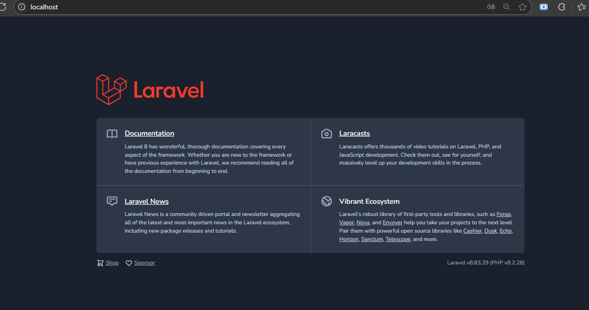
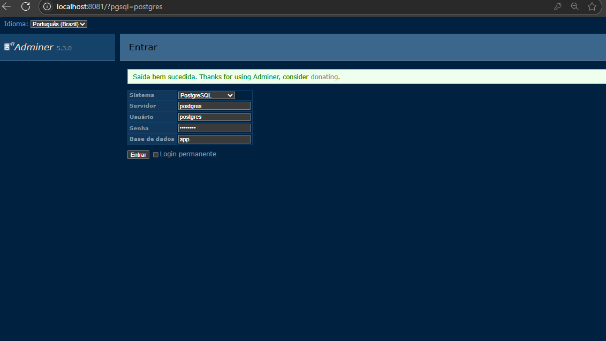
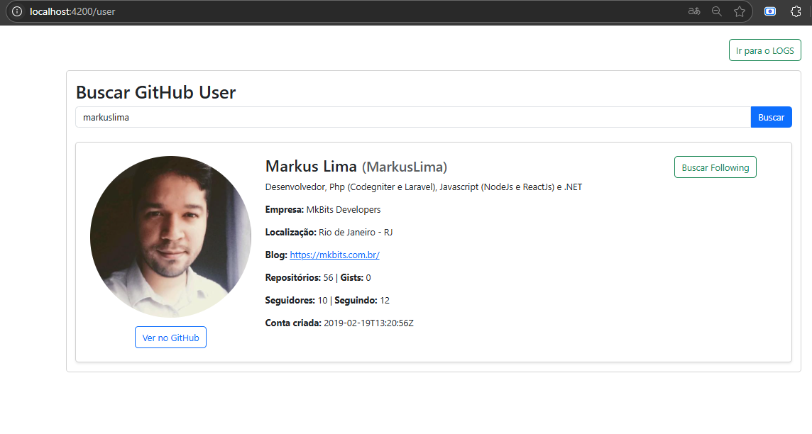
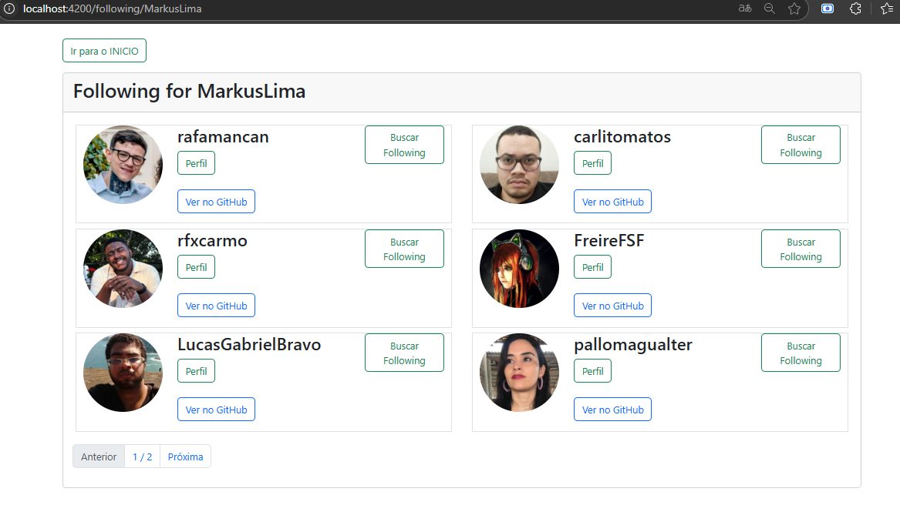

# GitHub Info Logger

Este é um projeto fullstack que utiliza **Laravel 8** no backend e **Angular 20** no frontend para consumir dados públicos da API do GitHub e registrar logs dessas interações em um banco de dados **PostgreSQL**.

A aplicação é executada via **Docker Compose**, garantindo um ambiente padronizado e fácil de configurar.

---

## 📦 Tecnologias Utilizadas

### Backend (Laravel 8)

- PHP ^8.2
- Laravel Framework ^8.75
- PostgreSQL
- PHPUnit (testes)
- RestFull
- Xdebug

### Frontend (Angular 20)

- Angular CLI 20
- Bootstrap 5
- Express (SSR)
- Prettier + ESLint

### Infraestrutura

- Docker Compose
- Nginx
- PostgreSQL 14
- Adminer (gerenciador de banco de dados)

---

## 📌 Funcionalidades

### 🔁 Backend (Laravel)

- Endpoint para buscar **detalhes do usuário do GitHub** (`/api/user/{username}`)
- Endpoint para listar os **seguidores de um usuário** (`/api/following/{username}`)
- Endpoint para **listar os logs registrados** (`/api/logs`)
- Endpoint para **detalhes do log registrado** (`/api/logs/{id}`)
- Middleware de log que registra automaticamente cada requisição relevante no banco
- Estrutura de API RESTful

### 💻 Frontend (Angular)

- Interface para buscar usuários do GitHub
- Visualização de seguidores do usuário
- Página para listar os logs das interações
- Paginação e tratamento de erros de forma amigável

---

## 🚀 Como Executar o Projeto

### 1. Pré-requisitos

- Docker
- Docker Compose

### 2. Clonar o repositório

```bash
git clone https://github.com/MarkusLima/docker_laravel_angular_postgres_adminer
cd docker_laravel_angular_postgres_adminer
```

## Estrutura organizacional do projeto

docker_laravel_angular_postgres_adminer/
├── laravel-app/       # Código-fonte Laravel
├── angular-app/       # Código-fonte Angular
├── nginx/             # Configurações do Nginx
├── docker-compose.yml # Executor docker
├── docs               # Documentos do projeto

### 3. Execute para instanciar o container
```bash 
docker compose -f 'docker-compose.yml' up -d --build
```

## Urls de acesso

Laravel: http://localhost


Adminer: http://localhost:8081 (login: postgres / postgres)


Angular: http://localhost:4200




## Para remover o container execute
```bash
docker compose -f 'docker-compose.yml' down
```

### Executar o Xdebug
- Verifique se tem algum serviço na porta 9003 e finalize ele
```bash
sudo kill -9 $(lsof -t -i :9003)
```

### Para criar as tabelas no banco de dados
```bash
docker exec -it laravel sh
php artisan migrate
```

### Para rodar os testes no laravel
```bash
docker exec -it laravel sh
php artisan test
```

### Para rodar o eslint angular
```bash
docker exec -it angular sh
ng lint
```


## 📄 Licença
Este projeto está licenciado sob a licença [MIT](LICENSE).

---

## ❓ Dúvidas ou Sugestões
Caso tenha alguma dúvida na execução do projeto, por favor, abra uma [issue](https://github.com/MarkusLima/docker_laravel_angular_postgres_adminer/issues) ou envie um e-mail(markuamk@gmail.com) para que possamos melhorar o projeto.